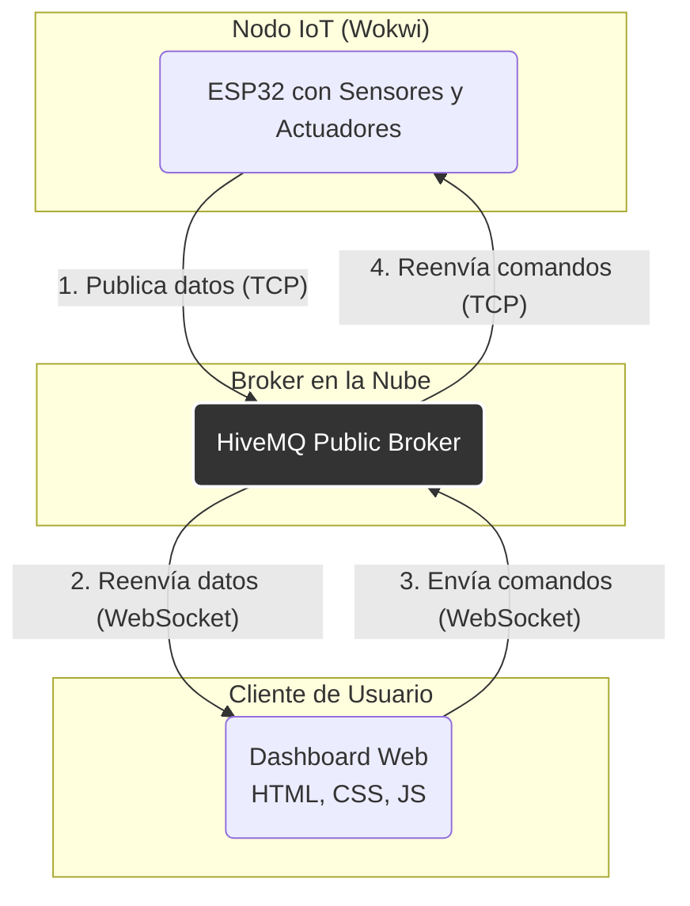
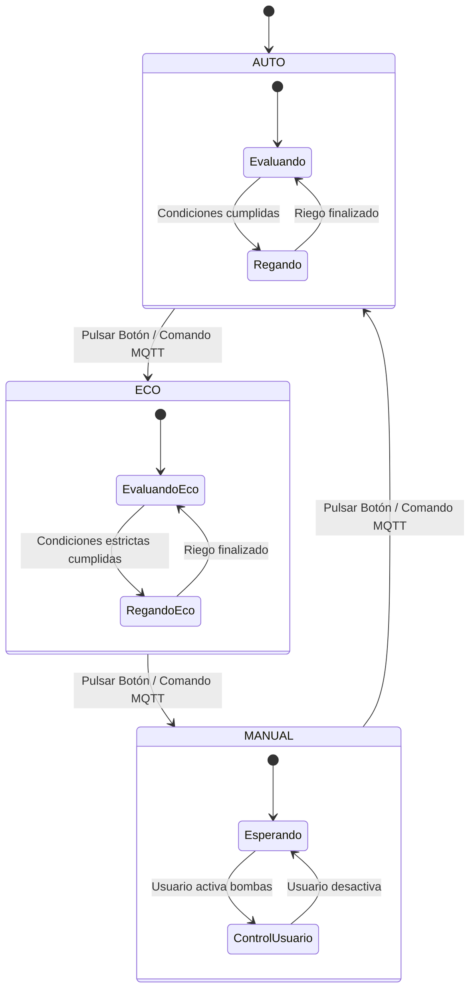

# Memoria Descriptiva: Prototipo de Sistema de Riego Hidropónico IoT

**Autor:** Miguel Puch Paíno  
**Autor:** Sayed Magdy Elsayed Abdellah  
**Asignatura:** Sistemas Ciber-Físicos
**Máster:** Máster en Ingeniería Informática  
**Fecha:** Diciembre 2025

---

## Introducción

Este documento detalla el diseño, la arquitectura y la implementación de un prototipo funcional para un sistema de monitorización y control de un invernadero hidropónico. El objetivo principal es demostrar la viabilidad técnica de un sistema IoT completo, integrando hardware (sensores y actuadores), un microcontrolador avanzado, protocolos de comunicación estándar y una interfaz de usuario web para la visualización y control en tiempo real.

El sistema ha sido desarrollado siguiendo las especificaciones y diseños definidos en entregables anteriores, culminando en un prototipo que, aunque simulado, representa un modelo fiel y funcional de un producto final. La solución adoptada se adhiere a las mejores prácticas de desarrollo de software empotrado, incluyendo el uso de un sistema operativo de tiempo real (FreeRTOS), gestión eficiente de energía y una arquitectura de software modular y escalable.

---

## 1. Diseño Final del Nodo IoT

El nodo IoT es el corazón del sistema, encargado de la adquisición de datos del entorno y el control de los actuadores. Está basado en un microcontrolador **ESP32**, simulado en el entorno **Wokwi**.

### 1.1. Diagrama de Conexiones

El siguiente diagrama, generado en Wokwi, ilustra las conexiones físicas entre el microcontrolador ESP32 y los periféricos (sensores y actuadores).

*(Nota: Este diagrama es una representación conceptual del archivo `diagram.json` del proyecto.)*


*Figura 1: Diagrama de conexiones del circuito en Wokwi.*

### 1.2. Tabla Descriptiva de Componentes

| Componente                 | Propósito                                     | Conexión ESP32        | Tipo de Señal |
| -------------------------- | --------------------------------------------- | --------------------- | ------------- |
| **ESP32**                  | Microcontrolador principal con WiFi y BT      | -                     | -             |
| **Sensor DHT22**           | Medición de temperatura y humedad ambiental   | `GPIO 15`             | Digital       |
| **Fotorresistencia (LDR)** | Medición de la intensidad lumínica            | `GPIO 34` (ADC1_CH6)  | Analógica     |
| **Potenciómetro Deslizante** | Simulación del nivel de agua en el depósito | `GPIO 35` (ADC1_CH7)  | Analógica     |
| **Potenciómetro de Control** | Ajuste dinámico del umbral de humedad        | `GPIO 33` (ADC1_CH5)  | Analógica     |
| **LED Azul**               | Indicador visual de la "Bomba de Riego"       | `GPIO 25`             | Digital (PWM) |
| **LED Verde**              | Indicador visual de la "Bomba de Nutrientes"  | `GPIO 26`             | Digital (PWM) |
| **Botón Pulsador**         | Cambio manual entre modos de operación        | `GPIO 32`             | Digital (IRQ) |
| **LCD 16x2 I2C**           | Pantalla para visualización de estado local   | `SDA:21`, `SCL:22`    | I2C           |

---

## 2. Arquitectura IoT Desarrollada

La arquitectura del sistema se ha diseñado para ser desacoplada, escalable y eficiente, utilizando el protocolo **MQTT** como eje central de la comunicación.

### 2.1. Diagrama de Arquitectura

El siguiente diagrama describe el flujo de información entre los componentes del sistema:



*Figura 2: Diagrama de la arquitectura IoT y flujo de datos.*

### 2.2. Descripción de Componentes y Flujo

1.  **Nodo IoT (ESP32):** El firmware del ESP32, escrito en C++ sobre FreeRTOS, se conecta a la red WiFi "Wokwi-GUEST". Lee los datos de los sensores, evalúa la lógica de control según el modo activo y publica periódicamente mensajes JSON en diferentes **topics MQTT** (`invernadero/nodo1/sensores`, `invernadero/nodo1/actuadores`, `invernadero/nodo1/estado`) a través de una conexión TCP estándar con el broker. También se suscribe al topic `invernadero/nodo1/comando` para recibir órdenes desde el dashboard.

2.  **Broker MQTT (HiveMQ):** Se utiliza un broker MQTT público (`broker.hivemq.com`). Actúa como intermediario, recibiendo todos los mensajes publicados por el ESP32 y distribuyéndolos a cualquier cliente suscrito. Este desacoplamiento permite que el nodo IoT y la interfaz de usuario no necesiten conocerse directamente.

3.  **Dashboard Web (Cliente):** Es una aplicación de una sola página construida en HTML, CSS y JavaScript.
4.  **Dashboard (Node-Red):** El sistema incluye un dashboard desarrollado en Node-Red que se conecta al broker MQTT. Node-Red actúa como middleware que:
   - Se suscribe a los topics de sensores, actuadores y estado para recibir datos en tiempo real
   - Publica comandos en el topic `invernadero/nodo1/comando` cuando el usuario interactúa con los controles
   - Presenta una interfaz web gráfica en `http://localhost:1880/ui` con gauges, botones y visualizaciones
   - Permite cambiar entre los modos de operación (AUTO, ECO, MANUAL) de forma intuitiva

---

## 3. Implementación de Casos de Uso

Se han implementado tres modos de operación que constituyen los principales casos de uso del sistema.

### Caso de Uso 1: Riego Automático Inteligente (Modo AUTO)

-   **Descripción:** El sistema opera de forma autónoma para mantener las condiciones óptimas del cultivo.
-   **Lógica:** La lógica de control, ejecutada cada 500 ms, verifica las siguientes condiciones:
    1.  El nivel de agua debe ser superior al umbral crítico (20%).
    2.  La humedad ambiental debe ser inferior al umbral configurado (por defecto, 50%).
    3.  La intensidad de luz debe ser superior a un mínimo (20%) para evitar riegos nocturnos.
    4.  Debe haber transcurrido un intervalo mínimo desde el último riego (30 segundos).
-   **Resultado:** Si todas las condiciones se cumplen, el sistema activa las bombas de riego y nutrientes durante 10 segundos. El dashboard refleja el cambio de estado de las bombas y los sensores en tiempo real.

### Caso de Uso 2: Ahorro de Energía (Modo ECO)

-   **Descripción:** Un modo de operación que prioriza la eficiencia energética, ideal para sistemas alimentados por batería.
-   **Lógica:** Similar al modo AUTO, pero con umbrales más estrictos y ciclos más largos para reducir la actividad.
    1.  Umbral de humedad más bajo (< 45%).
    2.  Umbral de luz más alto (> 30%).
    3.  Intervalo de riego extendido a 60 segundos.
    4.  Duración del riego reducida a 5 segundos.
-   **Resultado:** El sistema activa las bombas con menor frecuencia y durante menos tiempo. El firmware está preparado para entrar en modo **Deep Sleep** entre ciclos, guardando el estado del sistema en la memoria RTC del ESP32 para reanudar la operación correctamente tras despertar. (Nota: La función de Deep Sleep está comentada en el código final para permitir el monitoreo continuo desde el dashboard en la simulación).

### Caso de Uso 3: Control Manual Directo (Modo MANUAL)

-   **Descripción:** Permite al usuario tomar el control total sobre los actuadores para tareas de mantenimiento o pruebas.
-   **Lógica:**
    1.  El usuario selecciona "MANUAL" en el dashboard o mediante el botón físico en el nodo IoT.
    2.  La lógica de control automático se deshabilita.
    3.  Los interruptores de control de las bombas en el dashboard se habilitan.
-   **Resultado:** El usuario puede encender o apagar las bombas de riego y nutrientes a voluntad a través de la interfaz web. El sistema responde instantáneamente a los comandos enviados vía MQTT.

---

## 4. Código y Configuración

El prototipo es 100% funcional y reproducible utilizando el simulador online Wokwi y un servidor web local para el dashboard.

### 4.1. Estructura de Archivos

```
/
├── sketch.ino              # Firmware del ESP32 (C++, FreeRTOS, ESP-IDF)
├── index.html              # Estructura del dashboard web
├── FlowsModelInNodeRed.json # Flujo de Node-Red para dashboard
├── index.html              # Dashboard web alternativo (HTML5)
├── script.js               # Lógica del dashboard web (MQTT.js)
├── style.css               # Estilos del dashboard web
├── diagram.json            # Diagrama de conexiones Wokwi
├── wokwi.toml              # Configuración del proyecto Wokwi
├── libraries.txt           # Dependencias de bibliotecas Arduino
├── README.md               # Documentación del proyecto
├── memoria_descriptiva.md  # Este documento
└── System_Architecture.md  # Diagramas de arquitectura
```
├── style.css               # Estilos CSS para el dashboard
├── script.js               # Lógica del frontend (MQTT sobre WebSockets)
├── diagram.json            # Definición del circuito para Wokwi
├── libraries.txt           # Dependencias de librerías para Wokwi
├── README.md               # Guía completa de instalación y uso
└── memoria_descriptiva.md  # Este documento
```

### 4.2. Instrucciones de Ejecución

Las instrucciones detalladas se encuentran en el archivo `README.md`. A continuación, un resumen del proceso:

1.  **Simulación del Nodo IoT (Wokwi):**
    *   Crear un nuevo proyecto de ESP32 en Wokwi.
    *   Copiar el contenido de los archivos `sketch.ino`, `diagram.json` y `libraries.txt` en el editor de Wokwi.
    *   Iniciar la simulación. El ESP32 se conectará a la red y al broker MQTT.

2.  **Lanzamiento del Dashboard Web:**
    *   Tener Python 3 instalado.
    *   Abrir una terminal en la carpeta raíz del proyecto.
    *   Ejecutar el comando: `python -m http.server 8000` o `node-red`
    *   Abrir un navegador web y acceder a `http://localhost:8000` o a `http://localhost:1880/ui`

El dashboard se conectará automáticamente al broker MQTT y comenzará a mostrar los datos de la simulación en tiempo real.

---

## 5. Documentación Técnica Adicional

### 5.1. Soluciones Adoptadas y Justificación

-   **Sistema Operativo de Tiempo Real (FreeRTOS):** Se utilizó FreeRTOS para gestionar las múltiples tareas del sistema (lectura de sensores, lógica de control, comunicación MQTT, actualización de LCD) de manera concurrente y predecible. Esto mejora la robustez y la capacidad de respuesta del sistema en comparación con un enfoque basado en un super-bucle (`loop()`).

-   **API de Bajo Nivel (ESP-IDF):** Para tareas críticas como la lectura precisa de sensores y la gestión de energía, se utilizaron directamente las funciones del **ESP-IDF** (el framework nativo de Espressif) en lugar de las abstracciones de Arduino. Esto incluye:
    *   **Calibración del ADC:** Para obtener lecturas de voltaje precisas de los sensores analógicos.
    *   **Timers de Hardware:** Para disparar la tarea de control lógico a intervalos exactos, independientemente de otras tareas.
    *   **Gestión de Energía:** Para implementar el modo Deep Sleep y la persistencia de estado en la memoria RTC.

-   **Comunicación Desacoplada (MQTT):** La elección de MQTT permite una total independencia entre el hardware (nodo IoT) y el software (dashboard). Se pueden añadir múltiples nodos o diferentes interfaces de usuario sin necesidad de modificar el firmware existente.

-   **Interfaz Web Reactiva:** El dashboard no requiere un backend complejo. Utiliza la librería `mqtt.js` para comunicarse directamente con el broker a través de WebSockets, permitiendo una actualización de datos instantánea y una experiencia de usuario fluida.

### 5.2. Diagrama de Estados (Máquina de Estados Finita - FSM)

La lógica de control se implementa como una máquina de estados finita con tres estados principales, gestionada por la variable `modoActual`.



*Figura 3: Diagrama de la máquina de estados de los modos de operación.*
